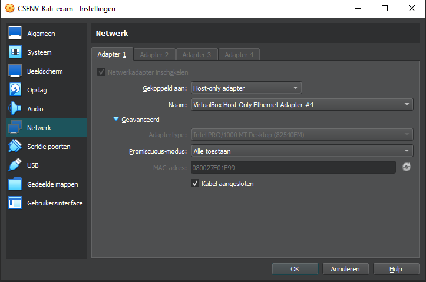

# Cybersecurity &amp; Virtualisation: 2. Virtual Networks

## Slides

### VirtualBox Network modes
- NAT
  - Default config for NIC, suitable for standalone VM
  - Typically 10.0.2.15 from VirtualBox virtual router, which serves as dhcp, nat, dns forwarder and dg
  - Port forwarding possible to host
  - VM's can't communicate between each other
- NAT Network
  - Similar to NAT, but VM's get an IP in 10.0.2.0/24 and can reach eachother
  - Can be reconfigured: Preferences > Network
  - Seperate virtual dg, dns, dhpc-server
- Bridged
  - Shares physical NIC and is (/could be) in the same subnet as the host
  - VM can reach host LAN &amp; WAN
  - VM can reach other VM's in this mode
  - Not suitable for wifi Enterprise
- Internal
  - VM's on the same virtual switch
  - VM's can reach eachother
  - VM's can't reach host/internet
- Host-Only
  - Suitable for communication VM-guest
  - VM's can reach eachother &amp; host
  - Default 192.168.56.0/24
  - DHCP possible

### Promiscuous Mode
- Default NIC behaviour: drop L2 frames with different destination MAC
- In order to snif the network, we need to be able to capture all network traffic
- Solution: Configure NIC in promiscuous mode:
  - No MAC-filtering
  - Higher layers &amp; applications can analyze this traffic
  - Default in WireShark (Capture > Options)
- Switch port needs to be configured in "Mirrored mode", usefull for sniffing, but also monitoring and IDS-inspection
  - Can be simulated in virtual environment
  - Needs extra steps IRL
  - Can be circomvented by placing machine in between in bridged mode

### Lab

### Capture your own DHCP traffic  
- Capture Instructions
  - Make sure that the Kali VM is connected using the (default) VirtualBox NAT mode
  - Release the IP address of your network card: ```sudo dhclient -r```.
  - Start Wireshark. Capture traffic on your interface ```eth0```.
  - Let the DHCP client process negotiate a new IP address: ```sudo dhclient```.
  - Stop the capture and save the results as a .pcap file.
- Questions related to your capture
  - Are DHCP messages sent over UDP or TCP?
    - UDP
  - What is the IP address of your DHCP server?
    - 10.0.2.2
  - Draw a timing datagram illustrating the sequence of the first four-packet Discover/Offer/Request/ACK DHCP exchange between the client and server. For each packet, indicated the source and destination port numbers.
    - Discover
      - L2: broadcast
      - L3: 0.0.0.0:68 255.255.255.255:67 
    - Offer
      - L2: unicast
      - L3: 10.0.2.2:67 10.0.2.15:68
    - Request
      - L2: broadcast
      - L3: 0.0.0.0:68 255.255.255.255:67
    - Ack
      - L2: unicastt
      - L3: 10.0.2.2:67 10.0.2.15:68
  - A host uses DHCP to obtain an IP address, among other things. But a host's IP address is not confirmed until the end of the four-message exchange! If the IP address is not set until the end of the four-message exchange, then what values are used in the IP datagrams in the four-message exchange? For each of the four DHCP messages (Discover/Offer/Request/ACK DHCP), indicate the source and destination IP addresses that are carried in the encapsulating IP datagram.
    - See above
  - Explain the purpose of the lease time. How long is the lease time in your experiment?
    - Time the client will hold the ip. 1 day in VirtualBox
    - Seen in offer &amp; ack as option 51 (86400s, 0x00 01 51 80)

### Make communication possible between both VMs &amp; internet
- Solution: NAT Network
- Control H in VirtualBox
- Also possible with VboxManage

### Make communication possible between both VMs &amp; internet
- Followed the instructions in 2.2.3

### Capture Telnet and SSH traffic
- TODO: document

### Capture all traffic from the Windows 10 client


### Optional: Setup using two networkinterfaces on the Kali VM
- Follow the instructions in Lab02-Solutions
  


## Misc
- wireshark filter: !arp
- wireshark filter: dhcp.option.ip_address_lease_time
- wireshark filter: ip.addr == 10.0.66.5
