# Cybersecurity &amp; Virtualisation: 4. Virtual Clones

## Slides

## Virtual Hardware
- Virtual Hardware:
  - A Virtual Machine (VM) is a software simulation of an entire computer system.
    - vCPU is scheduled by host on physical CPU
    - vRAM reserved on part of physical RAM
    - vNIC simulates or even couples physical NIC
    - vDisk is a file used by a virtual storage controller (sata/ide)
  - 97% of ip-addresses are VM's
  - Physical hardware can be reached in VM, but not simultaniously accessed by host
  - A VM: files
- Virtual Disk
  - A file representing a virtual hard disk
    - Virtualbox:: Virtual Disk Imagde .vdi
    - VMWare: Virtual Machine Disk .vmdk
    - Microsft: Virtual Hard Disk .vhd .vhdx
    - These formats are interchangable, but less performant then
  - Two types of allocation:
    - Static: Size is the Total Disk Size and allocated when created, mostly used for VM's in the cloud
    - Dynamic: Size grows following Used Space, which might be less performant
- Virtual Networks
  - VM can have multiple vNIC's
    - MAC-addressess can be manipulated
    - As seen in [chapter 2](2.md), different modes possible
  - Entire networks can be simulated in software
  - Network Function Virtualisation (NFV): Virtual Network Functions (NVF's) are combined to offer a network service: Often used with Software Defined Networking (SDN), <del>scope</del>

## Snapshots
- A Snapshot is a picture of the currect condition of a VM
  - Usefull when testing
  - Possible to revert to a earlier snapshot
  - Changes are final when snapshot is deleted (more space and efficiency)
  - Nested snapshots are possible
- How
  - Typically two files contain the VM
    - The virtual hard disk file .vdi
    - A config file with VM setting .vbox
  - A snapshot freezes the state:
    - Virtualdisk file read only
    - Disk changes are kept in a delta file .vdi
    - The config file is copied .vbox_bak
- Delta file
  - Keeps the changes made in the base virtual disk in the form of tuples (reference to changed block + new block)
- Certain overhead created by working with snapshot(s)
  - Additional disk space per delta file
  - Accessing data asks more cpu time for merging with base VDI (or other delta files)
  - Conclusion: Snapshot suitable for testing but not as a backup or working environment. 
- VirtualBox
  - Add: GUI menu Snapshots / VBoxManage, comment optional
  - Restore: reverts all changes since making snapshot (by clearing delta file)
  - Delete: makes changes to VM permanent by merging delta file into base VDI and thus removing the delta file and making the VDI writeable again.

## Cloning a VM
- Need
  - In large environments lots of systems are alike (OS, installed software)
  - Making a VM from scratch would be time consuming, options:
    - Automated boot environment eg. PXEBoot
    - Using a base template and sysprepping it
    - Cloning the VM
- Cloning
  - Copy of most settings
  - Possible to configure what not to clone (Mac/UUId/Snapshots)
  - Choice for the VDI
    - Full: comlete, independent copy of the VDI
    - Linked: Base VDI shared with original VM, creating two new delta files (+: space, -,clone dependent).
- VirtualBox: Plug and Play with GUI / VBoxManage

## Lab: Break the Clone
In this lab, we will experiment with both snapshots and cloning of virtual machines.

### Experiment with snapshots
The goal of this step is to experiment with snapshots in VirtualBox.
- Shutdown the virtual machine (if needed) and take a snapshot of the Virtual Machine  
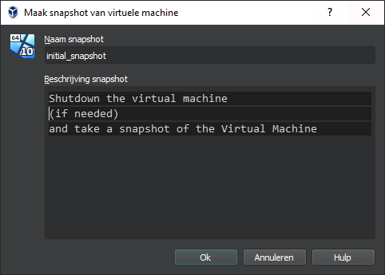
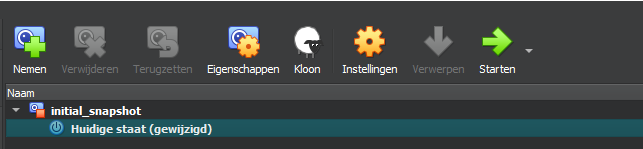
- Start the Virtual Machine and create a text file with some content on the Desktop.
- Try to answer the following questions:
  - Where is the base VDI stored? What size (in MB) is it?
    - C:\DATA\VMS\CSENV_win10base
    - 11.389.952 kB
  - Where is the delta file stored? What size (in MB) is it?
    - C:\DATA\VMS\CSENV_win10base\Snapshots
    - 1.223.680 (windows update was running, normally smaller)
- Power off the VM and restore the snapshot. Power on the virtual machine.  
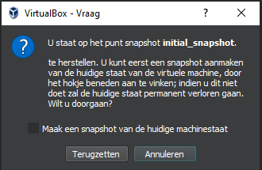
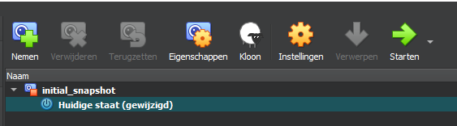
  - Is the textfile still present on the desktop? Why (not)?
    - The file is gone since it was added after the (now restored) snapshot was taken.
  - Does this change anything to the base VDI?
    - No, still the same size
  - Does this remove the delta file?
    - No, but it is very small now
  - If the textfile is missing: create a new textfile on the desktop.
- Power off the VM again and delete the snapshot. Power on the virtual machine.  
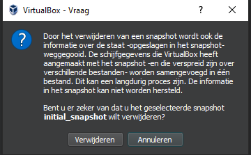
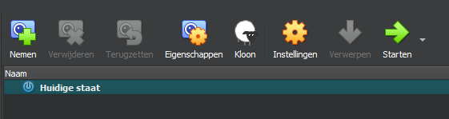
  - Is the textfile still present on the desktop? Why (not)?
    - Yes, the current state is merged with the snapshot.
  - Do you still have the delta file? Why (not)?
    - No, there is no more snapshot so no need to keep changes. The changes were merged with the base VDI which is now no longer read-only.

### Create a linked clone of the Windows VM
The next step is to create a linked clone of the Windows VM. Power off the Windows VM and create a clone of this virtual machine. Make sure to create a ***Linked*** clone (and not a Full clone).  

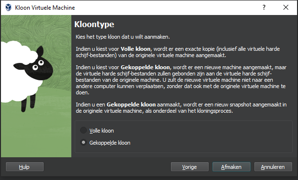  

Before starting the clone, look at the result:  

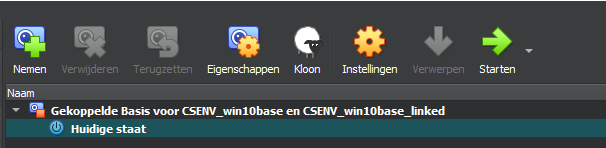  

- Where is the base VDI stored?
  - C:\DATA\VMS\CSENV_win10base\CSENV_win10base-disk1.vdi
- Where is/are the delta file(s) stored?
  - C:\DATA\VMS\CSENV_win10base\Snapshots\{c50a1ff0-6b1c-4c67-8b2b-7333186f736d}.vdi
  - C:\DATA\VMS\CSENV_win10base_linked\Snapshots\{c5a10499-410d-42e3-8c41-fe2ee681f182}.vdi
- What happened to the original VM?
  - A snapshot was taken at the moment the linked clone was created which now also serves as the base VDI for the current condition.
- What is the relationship between linked clones and snapshots?
  - Similar keeping delta files, but now in two different VM's

### Disarm the VM and experiment with anti malware testfile
For this step, we will **only** use the linked clone of the Windows VM. Shutdown any other virtual machines, and power on the linked clone. Install 7-zip (or any software that can extract password-encrypted ZIP files) on the cloned VM, as we will need this soon.  

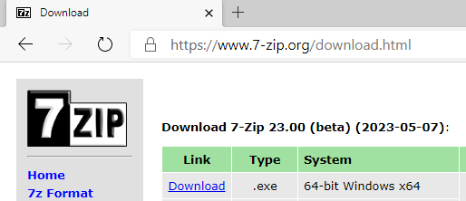  

Your next goal is to disable the Virus & Threat protection built into Windows as we want to make the VM vulnerable. This can be done in Windows Security - Virus & threat protection settings. Make sure to disable real-time protection, cloud-delivered protection and automatic submission.  

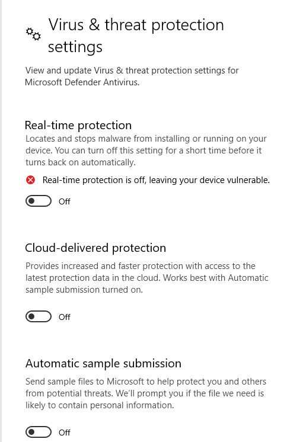 

Once your Windows 10 clone is completely unarmed, you can test this out by using the Anti Malware Testfile from https://www.eicar.org/?page_id=3950. This is not actual malware, but a file that looks like malware and it should be detected as a threat by any modern anti-virus software.  

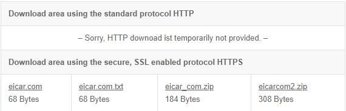  

Download the eicar testfile, and extract it to the desktop of your clone.  

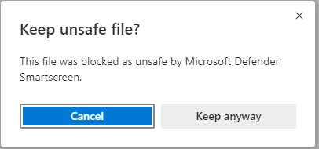  

If virus & threat protection is still active, the file will get quarantined soon, and removed from your desktop. However, as you just disarmed your VM, this should not be the case, and the file should remain where you extracted it - at this point you can reboot the VM to make sure that the virus protection is not re-enabled when rebooting. If the file is still present on the desktop after a reboot, you know that the VM remains unarmed even after a reboot. We are now ready for the next step, in which we will execute **actual malware** on the VM.  
- Note: Virus protection turns on again after eachr reboot, can't be turned off completely ...

### Break the clone
**WARNING** In this step, we will execute real malware inside the Virtual Machine. Before continuing, we **strongly** recommend disconnecting the virtual machine from any network. This can be done by opening the settings of the VM, and switching the network adapter mode to Disconnected.  

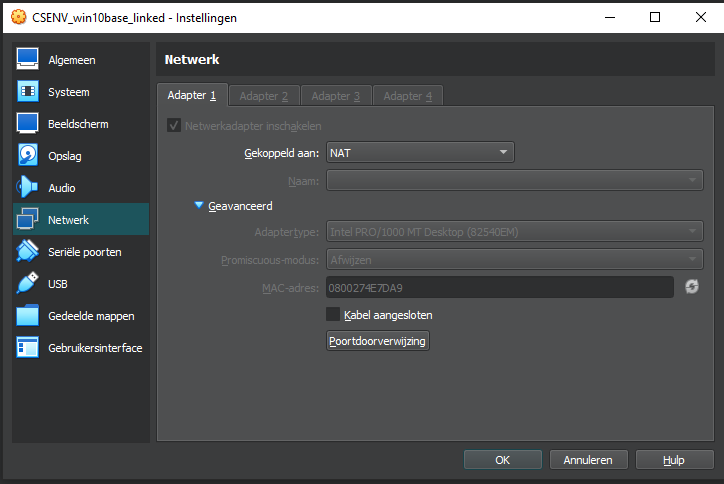

The malware we will be using is the HermeticWiper that was found on Ukraine's critical infrastructures few days after the start of the russian 'military operation' in February 2022. More information about this can be found here: https://yoroi.company/research/diskkill-hermeticwiper-a-disruptive-cyber-weapon-targeting-ukraines-critical-infrastructures/

For testing purposes, a real copy of this malware can be found in the Malware Bazaar: https://bazaar.abuse.ch/sample/1bc44eef75779e3ca1eefb8ff5a64807dbc942b1e4a2672d77b9f6928d292591/

- Download the encrypted zip file to your cloned VM.
- Extract the archive, using the password infected.  
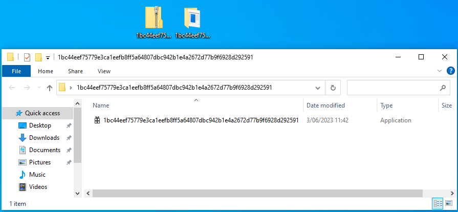  
- Execute the binary file (malware) on the Windows VM clone, make sure to run it as **Administrator** (Right click -> Run as Administrator).
- Keep working in the clone by opening some programs inside Windows (e.g. notepad, calculator, or even play a short game of solitaire).
- After 10-15 minutes, you might notice some weird behaviour. Time to reboot the virtual machine! If everything goes well, you will see a little surprise after rebooting the virtual machine!  
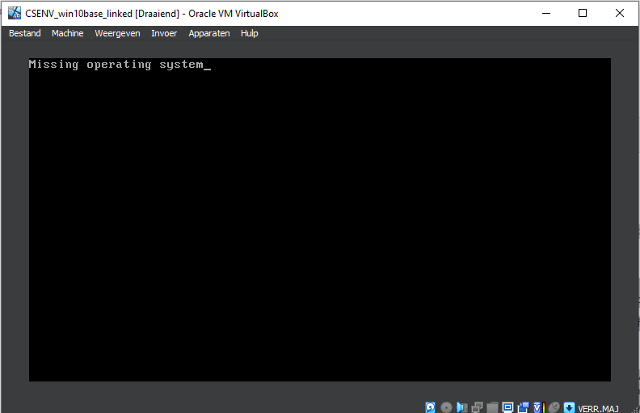
- Take a look at the base VDI and delta file. What is the current size of the delta file?
  - Delta file is over 14 GB (base still 11 GB, VDI of 20 GB when machine was made)

### Restore your setup
Once the linked clone is completely unusable, it is time to get rid of it.

- Fully power off the linked clone
- Remove the linked clone (delete all files)
- Remove the snapshot of the original VM (which was automatically created when creating the clone)
- Start the original VM
  - Is 7-zip installed on the VM?
    - No
  - Is the antivirus software still disabled?
    - No
  - Can you find any traces of the test malware or HermeticWiper on the VM?
    - No
  - Is the VM working as it should?
    - Apparently

If you did all steps correctly, you should notice that the original VM is still unaffected by the malware, and 7-zip should not be installed yet (unless you installed it before creating the linked clone).