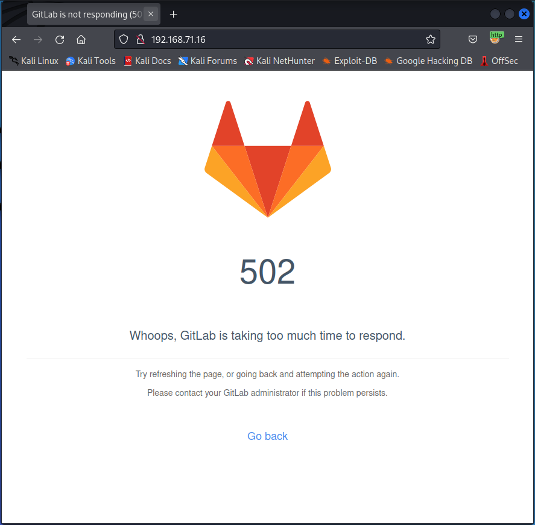
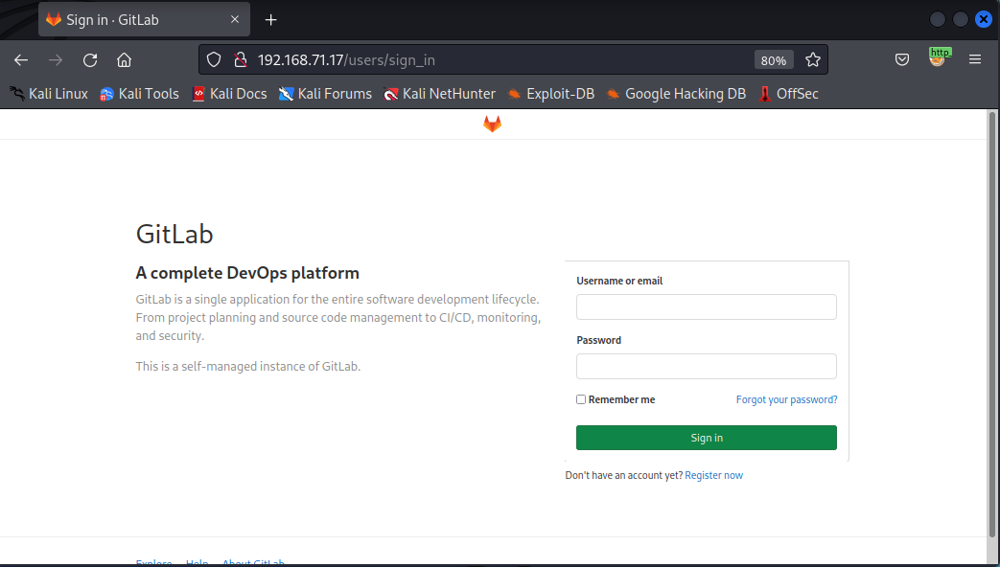

# Cybersecurity &amp; Virtualisation: 5. Upgrade your skills

## Slides

### Nmap
- Network scanning: identifying hosts, ports and services in a network
- Part of information gathering
  - What network am I on
  - ARP Scan/Sweep
  - Ping Sweep
  - Port Scan
- Tools
  - AngryIP Scanner
  - SolarWindsPing sweep
  - Nmap
  - Basic commands:
    - Ping (may miss systems blocking ICMP)
    - L: arpping (may require root)
    - W: arp-ping
    - PS> 1..20 | % {"192.168.1.$($_): $(Test-Connection -count 1 -comp 192.168.1.$($_) -quiet)"}
- Nmap
  - Network Mapper: Most powerfull open-source all-in-one tool that can discover hosts and services on a computer network
  - Multi-platform
  - GUI: NmapFE/ Zenmap
  - Features
    - Host discovery: identify hosts on network, e.g. hosts that respond to TCP and/or ICMP requests
    - Port Scanning: enumerate open ports on target (by trying to connect to them)
    - Version detection: determine application name and version number of network services
    - TCP/IP Stack Fingerprinting: determine OS and hardware characteristics of network devices
    - Scriptable interaction with target, using Nmap Scripting Engine (NSE) and Lua programming language
  - Tips
    - Know what you are doing: OPSEC-safe
    - nmap --help
  - Commands to remember
    - Scan 1000 most known ports
      - nmap 192.168.1.22
      - nmap -top-ports 1000 192.168.1.22
    - Scan only port 22 for 100 systems: nmap –p22 192.168.1.1-100 (192.168.5.0/24)
    - Scan all ports on 1 system: nmap–p–192.168.1.22
    - Banner grab, connect with the service and try to find out what is is: nmap –sV –p22,80,443 192.168.1.22


## Lab: Nmap, HackTheBox and VBoxManage

### Port scanning

The goal of this step is to experiment with the ```nmap``` command from a terminal. We recommend using the Kali VM for this, as nmap is already installed inside this VM.

- Execute a simple scan on **scanme.nmap.org**. Which ports are open?
```code
$ nmap scanme.nmap.org
Starting Nmap 7.92 ( https://nmap.org ) at 2023-06-05 04:45 EDT
Nmap scan report for scanme.nmap.org (45.33.32.156)
Host is up (0.15s latency).
Other addresses for scanme.nmap.org (not scanned): 2600:3c01::f03c:91ff:fe18:bb2f
Not shown: 996 filtered tcp ports (no-response)
PORT     STATE SERVICE
22/tcp   open  ssh
80/tcp   open  http
5060/tcp open  sip
5061/tcp open  sip-tls

Nmap done: 1 IP address (1 host up) scanned in 16.15 seconds

# nmap scanme.nmap.org
Starting Nmap 7.92 ( https://nmap.org ) at 2023-06-05 04:43 EDT
Nmap scan report for scanme.nmap.org (45.33.32.156)
Host is up (0.022s latency).
Other addresses for scanme.nmap.org (not scanned): 2600:3c01::f03c:91ff:fe18:bb2f
Not shown: 987 filtered tcp ports (no-response)
PORT      STATE  SERVICE
21/tcp    closed ftp
22/tcp    open   ssh
25/tcp    closed smtp
80/tcp    open   http
143/tcp   closed imap
587/tcp   closed submission
993/tcp   closed imaps
5060/tcp  open   sip
5061/tcp  open   sip-tls
52673/tcp closed unknown
54045/tcp closed unknown
57797/tcp closed unknown
58080/tcp closed unknown

Nmap done: 1 IP address (1 host up) scanned in 13.67 seconds

```

- Has ```nmap``` scanned all 65535 possible ports on scanme.nmap.org? How many has it actually scanned? How can you scan all ports?
  - Only the top 1000 ports were scanned (man nmap)
  - Our setup with NAT is not ideal for this ...
```code
$ nmap -p 1-65535 scanme.nmap.org
$ nmap -p- -v -r -Pn scanme.nmap.org
Host discovery disabled (-Pn). All addresses will be marked 'up' and scan times may be slower.
Starting Nmap 7.92 ( https://nmap.org ) at 2023-06-05 05:11 EDT
Initiating Parallel DNS resolution of 1 host. at 05:11
Completed Parallel DNS resolution of 1 host. at 05:11, 0.14s elapsed
Initiating Connect Scan at 05:11
Scanning scanme.nmap.org (45.33.32.156) [65535 ports]
Discovered open port 22/tcp on 45.33.32.156
Discovered open port 80/tcp on 45.33.32.156
Connect Scan Timing: About 2.50% done; ETC: 05:32 (0:20:10 remaining)
Increasing send delay for 45.33.32.156 from 0 to 5 due to 11 out of 32 dropped probes since last increase.
Connect Scan Timing: About 6.07% done; ETC: 05:28 (0:15:44 remaining)
Discovered open port 5060/tcp on 45.33.32.156
Discovered open port 5061/tcp on 45.33.32.156
Connect Scan Timing: About 11.80% done; ETC: 05:28 (0:14:42 remaining)
Connect Scan Timing: About 17.00% done; ETC: 05:28 (0:13:45 remaining)
Connect Scan Timing: About 21.42% done; ETC: 05:27 (0:12:54 remaining)
Connect Scan Timing: About 27.22% done; ETC: 05:28 (0:12:05 remaining)
Connect Scan Timing: About 32.33% done; ETC: 05:28 (0:11:14 remaining)
Connect Scan Timing: About 37.37% done; ETC: 05:28 (0:10:20 remaining)
Connect Scan Timing: About 42.40% done; ETC: 05:28 (0:09:28 remaining)
Connect Scan Timing: About 47.46% done; ETC: 05:27 (0:08:36 remaining)
Connect Scan Timing: About 52.76% done; ETC: 05:28 (0:07:46 remaining)
Connect Scan Timing: About 58.29% done; ETC: 05:28 (0:06:55 remaining)
Connect Scan Timing: About 63.25% done; ETC: 05:28 (0:06:05 remaining)
Connect Scan Timing: About 68.44% done; ETC: 05:28 (0:05:13 remaining)
Connect Scan Timing: About 73.45% done; ETC: 05:28 (0:04:23 remaining)
Connect Scan Timing: About 78.29% done; ETC: 05:27 (0:03:33 remaining)
Connect Scan Timing: About 83.29% done; ETC: 05:27 (0:02:42 remaining)
Connect Scan Timing: About 88.39% done; ETC: 05:27 (0:01:51 remaining)
Connect Scan Timing: About 93.43% done; ETC: 05:27 (0:01:02 remaining)
Completed Connect Scan at 05:27, 946.28s elapsed (65535 total ports)
Nmap scan report for scanme.nmap.org (45.33.32.156)
Host is up (0.18s latency).
Other addresses for scanme.nmap.org (not scanned): 2600:3c01::f03c:91ff:fe18:bb2f
Not shown: 65531 filtered tcp ports (no-response)
PORT     STATE SERVICE
22/tcp   open  ssh
80/tcp   open  http
5060/tcp open  sip
5061/tcp open  sip-tls

Read data files from: /usr/bin/../share/nmap
Nmap done: 1 IP address (1 host up) scanned in 946.46 seconds
```

- You'll notice only TCP ports are listed, how can you scan for UDP ports?
```code
$ sudo nmap -sU scanme.nmap.org
```

- You are now probably waiting quite some time and no ports show up. Why? How can you speed up the process by only scanning for the 20 most common ports? How long does this take? Which open ports do you find?
```code
$ sudo nmap -sU --top-ports 20 scanme.nmap.org
Starting Nmap 7.92 ( https://nmap.org ) at 2023-06-05 05:15 EDT
Nmap scan report for scanme.nmap.org (45.33.32.156)
Host is up (0.0040s latency).
Other addresses for scanme.nmap.org (not scanned): 2600:3c01::f03c:91ff:fe18:bb2f

PORT      STATE         SERVICE
53/udp    open|filtered domain
67/udp    open|filtered dhcps
68/udp    open|filtered dhcpc
69/udp    open|filtered tftp
123/udp   open|filtered ntp
135/udp   open|filtered msrpc
137/udp   open|filtered netbios-ns
138/udp   open|filtered netbios-dgm
139/udp   open|filtered netbios-ssn
161/udp   open|filtered snmp
162/udp   open|filtered snmptrap
445/udp   open|filtered microsoft-ds
500/udp   open|filtered isakmp
514/udp   open|filtered syslog
520/udp   open|filtered route
631/udp   open|filtered ipp
1434/udp  open|filtered ms-sql-m
1900/udp  open|filtered upnp
4500/udp  open|filtered nat-t-ike
49152/udp open|filtered unknown

Nmap done: 1 IP address (1 host up) scanned in 1.71 seconds
```

- Let's go back to scanning TCP ports only. How can we detect which operating system and services run on these ports using ```nmap```?
```code
$ nmap -sV -p22,80,5060,5061 scanme.nmap.org
Starting Nmap 7.92 ( https://nmap.org ) at 2023-06-05 05:19 EDT
Nmap scan report for scanme.nmap.org (45.33.32.156)
Host is up (0.15s latency).
Other addresses for scanme.nmap.org (not scanned): 2600:3c01::f03c:91ff:fe18:bb2f

PORT     STATE SERVICE  VERSION
22/tcp   open  ssh      OpenSSH 6.6.1p1 Ubuntu 2ubuntu2.13 (Ubuntu Linux; protocol 2.0)
80/tcp   open  http?
5060/tcp open  sip?
5061/tcp open  sip-tls?
Service Info: OS: Linux; CPE: cpe:/o:linux:linux_kernel

Service detection performed. Please report any incorrect results at https://nmap.org/submit/ .
Nmap done: 1 IP address (1 host up) scanned in 100.96 seconds

```

- ```nmap``` has support to run scripts. One of these scripts is the ```vulners``` script to see which vulnerabilities exist on the detected ports. See https://github.com/vulnersCom/nmap-vulners for more information. Which vulnerabilities do you detect for the SSH server at **scanme.nmap.org**?
```code
$ nmap -sV --script vulners -p 22 scanme.nmap.org
Starting Nmap 7.92 ( https://nmap.org ) at 2023-06-05 05:29 EDT
Nmap scan report for scanme.nmap.org (45.33.32.156)
Host is up (0.17s latency).
Other addresses for scanme.nmap.org (not scanned): 2600:3c01::f03c:91ff:fe18:bb2f

PORT   STATE SERVICE VERSION
22/tcp open  ssh     OpenSSH 6.6.1p1 Ubuntu 2ubuntu2.13 (Ubuntu Linux; protocol 2.0)
| vulners: 
|   cpe:/a:openbsd:openssh:6.6.1p1: 
|       CVE-2015-5600   8.5     https://vulners.com/cve/CVE-2015-5600
|       CVE-2015-6564   6.9     https://vulners.com/cve/CVE-2015-6564
|       CVE-2018-15919  5.0     https://vulners.com/cve/CVE-2018-15919
|       CVE-2021-41617  4.4     https://vulners.com/cve/CVE-2021-41617
|       CVE-2020-14145  4.3     https://vulners.com/cve/CVE-2020-14145
|       CVE-2015-5352   4.3     https://vulners.com/cve/CVE-2015-5352
|_      CVE-2015-6563   1.9     https://vulners.com/cve/CVE-2015-6563
Service Info: OS: Linux; CPE: cpe:/o:linux:linux_kernel

Service detection performed. Please report any incorrect results at https://nmap.org/submit/ .
Nmap done: 1 IP address (1 host up) scanned in 2.01 seconds
```

- **(Expert)** ```104.131.102.149``` is a server for a free open source game. Can you find out which game? Can you connect to the server and play this game (Remember, the game client is free)? Tip: this question could take quite some time (both from you as from ```nmap```).
```code
$ sudo nmap -sU -p30000 104.131.102.149
[sudo] password for osboxes: 
Starting Nmap 7.92 ( https://nmap.org ) at 2023-06-05 05:31 EDT
Nmap scan report for 104.131.102.149
Host is up (0.0029s latency).

PORT      STATE         SERVICE
30000/udp open|filtered unknown

Nmap done: 1 IP address (1 host up) scanned in 0.38 seconds
```

### VBoxManage
VBoxManage is the command-line interface to VirtualBox. With it, you can completely control VirtualBox from the command line of your host operating system. In this step, we will experiment with some basic functionality of the ```VBoxManage``` command.

- The first step is to locate the VBoxManage executable on your host system. Where is the binary file stored, and how can you use it?
  - C:\Program Files\Oracle\VirtualBox
  - put it in your path or execute it from that location

- Which command can you use to get a list of all your VirtualBox VMs? Which command can you use to start a given VM (e.g. the Kali VM)?
```code
C:\Program Files\Oracle\VirtualBox> VBoxManage list vms
C:\Program Files\Oracle\VirtualBox> VBoxManage startvm Kali
```

- Change the amount of virtual RAM assigned to your Kali VM using the VBoxManage command, for example from 1GB to 2GB. Which command(s) do you use for this?
```code
C:\Program Files\Oracle\VirtualBox> VBoxManage modifyvm Kali --memory 2048
```

- Change the amount of video RAM used by the virtual display adapter of your Kali VM, for example from 25MB to 64MB. Which command(s) do you use for this?
```code
C:\Program Files\Oracle\VirtualBox> VBoxManage modifyvm Kali --vram 64
```

- Create a new snapshot of your Kali VM using VBoxManage. Which command(s) do you use for this?
```code
C:\Program Files\Oracle\VirtualBox> VboxManage snapshot Kali take test --description="Test snapshot of Kali VM"
```

- Delete the snapshot you created in the previous step using VBoxManage. Which command(s) do you use for this?
```code
C:\Program Files\Oracle\VirtualBox> VboxManage snapshot KaliLinux delete test
```

### Scan Enumerate Exploit
#### Setup
- Start by creating 2 linked clones that use the Debian (csvrouter) virtual machine as base. As a mac address policy you can choose: "Generate new Mac address for all network adapters" and leave the default checks blank for "keep disk names" and "keep hardware uuids".
- In the settings of the virtual machine, remove the second network adapter and change the first one to the host-only network adapter we created in lab 2.
- Go in the VirtualBox settings of the machine and change the mac address of the first clone to "DCA632DCBA21" and the mac address of the second clone to "000393AB12CD".
- Login to the clones and change their IP configuration to receive everything from DHCP.
- Stop and disable the DHCP, DNS and nftables services. Review the script of lab 2.2.3 of virtual networks if necessary.
- Perform the same actions on the second clone.
- Use your VBoxManage knowledge to increase the memory of clone 1 to 4GB.
- Boot all other machines (so as a total this would be: the original Debian csvrouter, kali, windows 10 and the two clones).
- Verify that all machines receive an IP address in the same network and are able to connect to each other (ping, ssh, etc should work).
- Install docker on the first clone, following the official documentation of docker: https://docs.docker.com/engine/install/debian/
- Run the following docker command:
```code
sudo docker run --detach --hostname gitlab-docker --publish 80:80 --publish 443:443 --publish 2222:22 --name gitlab-docker --restart always --volume /opt/gitlab-docker/config:/etc/gitlab --volume /opt/gitlab-docker/logs:/var/log/gitlab --volume /opt/gitlab-docker/:/var/opt/gitlab --shm-size 256m gitlab/gitlab-ce:13.8.7-ce.0
```
```code
root@debrouter:~# docker run --detach --hostname gitlab-docker --publish 80:80 --publish 443:443 --publish 2222:22 --name gitlab-docker --restart always --volume /opt/gitlab-docker/config:/etc/gitlab --volume /opt/gitlab-docker/logs:/var/log/gitlab --volume /opt/gitlab-docker/:/var/opt/gitlab --shm-size 256m gitlab/gitlab-ce:13.8.7-ce.0
Unable to find image 'gitlab/gitlab-ce:13.8.7-ce.0' locally
13.8.7-ce.0: Pulling from gitlab/gitlab-ce
4007a89234b4: Pull complete 
c1de0f9cdfc1: Pull complete 
c8ee6ca703b8: Pull complete 
b39e2761d3d4: Pull complete 
836238cdf1df: Pull complete 
7b232270d87e: Pull complete 
58bce7a59ff5: Pull complete 
215d666e2f10: Pull complete 
6f0d7bbaf60e: Pull complete 
a281067bd37c: Pull complete 
Digest: sha256:fe941ed02fcfa8321746d397f04889a06f2e5b020e1401eb2b9dfd033deee2e7
Status: Downloaded newer image for gitlab/gitlab-ce:13.8.7-ce.0                                                                                                                                                                             
68cf36fa908de159a46d71d15a5ba0b3945126a320ea2ab73a072e54730f2ab1
root@debrouter:~# docker ps
CONTAINER ID   IMAGE                          COMMAND             CREATED                                             PORTS                                                                                                NAMES
68cf36fa908d   gitlab/gitlab-ce:13.8.7-ce.0   "/assets/wrapper"   45 seconds ago   Up 34 seconds (health: starting)   0.0.0.0:80->80/tcp, :::80->80/tcp, 0.0.0.0:443->443/tcp, :::443->443/tcp, 0.0.0.0:2222->22/tcp, :::2222->22/tcp   gitlab-docker
root@debrouter:~# ss -tlnp
State                   Recv-Q                  Send-Q                                   Local Address:Port                                     Peer Address:Port                  Process                                                  
LISTEN                  0                       4096                                           0.0.0.0:443                                           0.0.0.0:*                      users:(("docker-proxy",pid=1913,fd=4))                  
LISTEN                  0                       4096                                           0.0.0.0:2222                                          0.0.0.0:*                      users:(("docker-proxy",pid=1931,fd=4))                  
LISTEN                  0                       4096                                           0.0.0.0:80                                            0.0.0.0:*                      users:(("docker-proxy",pid=1951,fd=4))                  
LISTEN                  0                       128                                            0.0.0.0:22                                            0.0.0.0:*                      users:(("sshd",pid=302,fd=3))                           
LISTEN                  0                       4096                                              [::]:443                                              [::]:*                      users:(("docker-proxy",pid=1918,fd=4))                  
LISTEN                  0                       4096                                              [::]:2222                                             [::]:*                      users:(("docker-proxy",pid=1936,fd=4))                  
LISTEN                  0                       4096                                              [::]:80                                               [::]:*                      users:(("docker-proxy",pid=1956,fd=4))                  
LISTEN                  0                       128                                               [::]:22                                               [::]:*                      users:(("sshd",pid=302,fd=4))                           
```
- Browse to the IP address of this clone and verify GitLab is up and running (note: it might take a while for GitLab to be fully started: it might show a status error code of 502 for a bit). Choose a root password and try logging in.  
  
  

- Log in to the second clone and change the port of the SSH server to port 33 (use Google if necessary).


- Install nginx, ncat and tmux on this machine (use Google if necessary).
- In an SSH session to the second clone, start tmux. Type ```sudo python3 -m http.server```. Open a second pane by using the correct shortcut in tmux and run ```sudo ncat -lvnp 443```
```code
$ ssh benny@192.168.71.16 -p 33                
benny@192.168.71.16's password: 
Linux debrouter 5.10.0-23-amd64 #1 SMP Debian 5.10.179-1 (2023-05-12) x86_64

The programs included with the Debian GNU/Linux system are free software;
the exact distribution terms for each program are described in the
individual files in /usr/share/doc/*/copyright.

Debian GNU/Linux comes with ABSOLUTELY NO WARRANTY, to the extent
permitted by applicable law.
Last login: Mon Jun  5 21:10:07 2023 from 192.168.71.15
benny@debrouter:~$tmux

```


#### Time to scan
- Perform a ping sweep using nmap with and without sudo. What is the difference? What protocol is used? It might be interesting to open wireshark in your kali to answer this question. Finally have a look at the mac addresses. What do you notice?
```code
$ nmap -sn 192.168.71.0/24 
Starting Nmap 7.92 ( https://nmap.org ) at 2023-06-05 15:38 EDT
Nmap scan report for 192.168.71.10
Host is up (0.00057s latency).
Nmap scan report for 192.168.71.11
Host is up (0.0032s latency).
Nmap scan report for 192.168.71.15
Host is up (0.0029s latency).
Nmap scan report for 192.168.71.16
Host is up (0.0027s latency).
Nmap done: 256 IP addresses (4 hosts up) scanned in 2.56 seconds

$ sudo nmap -sn 192.168.71.0/24
[sudo] password for osboxes: 
Starting Nmap 7.92 ( https://nmap.org ) at 2023-06-05 15:39 EDT
Nmap scan report for 192.168.71.1
Host is up (0.00027s latency).
MAC Address: 0A:00:27:00:00:13 (Unknown)
Nmap scan report for 192.168.71.10
Host is up (0.00039s latency).
MAC Address: 08:00:27:E1:85:48 (Oracle VirtualBox virtual NIC)
Nmap scan report for 192.168.71.15
Host is up (0.00083s latency).
MAC Address: 00:03:93:AB:12:CD (Apple)
Nmap scan report for 192.168.71.16
Host is up (0.00076s latency).
MAC Address: DC:A6:32:DC:BA:21 (Raspberry Pi Trading)
Nmap scan report for 192.168.71.11
Host is up.
Nmap done: 256 IP addresses (5 hosts up) scanned in 2.06 seconds
```
- The ping sweep command should give an answer on the question: *"how many hosts are up in the network"*. Now perform a normal default nmap scan without any options on the Windows client. What ports are scanned and open? (tip: use wireshark again)
  - None seem to be open
- An open port being does not necessarily mean that the service that nmap tells you, is the actual service running on that port. Nmap uses a default mapping for ports. First, perform a normal scan on clone 1 and afterwards perform a banner grab to verify the services. What do you notice?
```code
$ sudo nmap 192.168.71.15                
Starting Nmap 7.92 ( https://nmap.org ) at 2023-06-05 15:49 EDT
Nmap scan report for 192.168.71.15
Host is up (0.000096s latency).
Not shown: 997 closed tcp ports (reset)
PORT     STATE SERVICE
22/tcp   open  ssh
80/tcp   open  http
2222/tcp open  EtherNetIP-1
MAC Address: 00:03:93:AB:12:CD (Apple)

Nmap done: 1 IP address (1 host up) scanned in 0.20 seconds

$ sudo nmap -sV 192.168.71.15
Starting Nmap 7.92 ( https://nmap.org ) at 2023-06-05 15:49 EDT
Nmap scan report for 192.168.71.15
Host is up (0.00011s latency).
Not shown: 997 closed tcp ports (reset)
PORT     STATE SERVICE VERSION
22/tcp   open  ssh     OpenSSH 8.4p1 Debian 5+deb11u1 (protocol 2.0)
80/tcp   open  http    nginx
2222/tcp open  ssh     OpenSSH 7.2p2 Ubuntu 4ubuntu2.10 (Ubuntu Linux; protocol 2.0)
MAC Address: 00:03:93:AB:12:CD (Apple)
Service Info: OS: Linux; CPE: cpe:/o:linux:linux_kernel

Service detection performed. Please report any incorrect results at https://nmap.org/submit/ .
Nmap done: 1 IP address (1 host up) scanned in 6.65 seconds
```

- Do the same for the second clone. Take a very good look at the behavior of port 443 (have a look at your tmux shell and ncat command). Does scanning without a banner grab has influence on this port being open/closed. What if you perform the banner grab? This demonstrates that you should take care when it comes down to choosing nmap options!
```code
$ sudo nmap 192.168.71.16    
Starting Nmap 7.92 ( https://nmap.org ) at 2023-06-05 15:52 EDT
Nmap scan report for 192.168.71.16
Host is up (0.00011s latency).
Not shown: 996 closed tcp ports (reset)
PORT     STATE SERVICE
33/tcp   open  dsp
80/tcp   open  http
443/tcp  open  https
8000/tcp open  http-alt
MAC Address: DC:A6:32:DC:BA:21 (Raspberry Pi Trading)

Nmap done: 1 IP address (1 host up) scanned in 0.20 seconds

$ sudo nmap -sV 192.168.71.16
Starting Nmap 7.92 ( https://nmap.org ) at 2023-06-05 15:53 EDT
Nmap scan report for 192.168.71.16
Host is up (0.000087s latency).
Not shown: 996 closed tcp ports (reset)
PORT     STATE SERVICE VERSION
33/tcp   open  ssh     OpenSSH 8.4p1 Debian 5+deb11u1 (protocol 2.0)
80/tcp   open  http    nginx 1.18.0
443/tcp  open  https?
8000/tcp open  http    SimpleHTTPServer 0.6 (Python 3.9.2)
MAC Address: DC:A6:32:DC:BA:21 (Raspberry Pi Trading)
Service Info: OS: Linux; CPE: cpe:/o:linux:linux_kernel

Service detection performed. Please report any incorrect results at https://nmap.org/submit/ .
Nmap done: 1 IP address (1 host up) scanned in 11.43 seconds
```

- Perform a UDP scan on the csvrouter. What UDP port is open?
  - 53

#### Time to exploit
Our GitLab running in a docker container with a specific version is vulnerable. Use the Metasploit framework and figure out a way to successfully gain a meterpreter shell from your kali. If you have a meterpreter shell answer the following questions:
- Run the ```sysinfo``` command in meterpreter. What IP address do you notice? Is this the IP address of the clone?
- What architecture is the machine and what meterpeter architecture do you have (32bit or 64bit) ?
- Use the ```shell``` command to gain a shell. Try out ```ls``` and ```ip a```. What do you notice?

## Hack the Box
Let's apply what we have learned so far on https://hackthebox.eu . Create an account and go to starting point .

You'll notice there are 2 tiers: tier 0 and 1. Each has 3 free machines available to which you can connect. In order to connect to these machines, you'll need to open an OpenVPN connection to the network of Hack the Box by downloading and importing an .ovpn file.

To connect using OpenVPN, you can either use your Kali VM (which has OpenVPN already installed), or install OpenVPN (and a telnet client if needed) on your host system.

More information can be found here . If you still have difficulties, you can find video tutorials on youtube .

Can you solve the challenges of the following machines?

- Tier 0 "the key is a strong foundation"
  - Meow: nmap + telnet
  - Fawn: nmap + FTP
  - Dancing: nmap + SMB
- Tier 1 "you need to walk before you can run"
  - Appointment: SQL injection + gobuster
  - Sequel: MariaDB
  - Crocodile: nmap + FTP + gobuster
**Tip**: the starting point machines have walkthroughs available in pdf which you can consult if you're stuck. Look for the "Download Walkthrough" button.