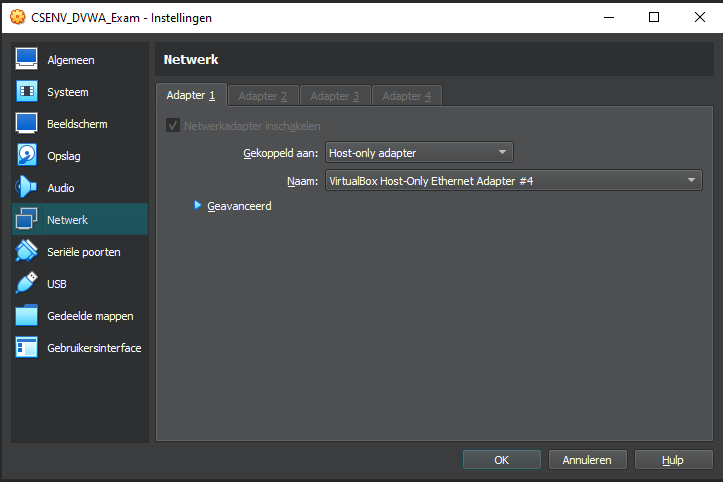
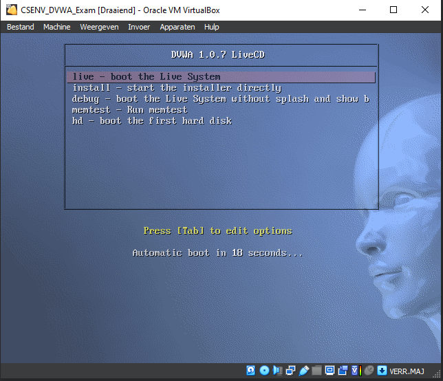
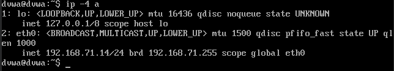
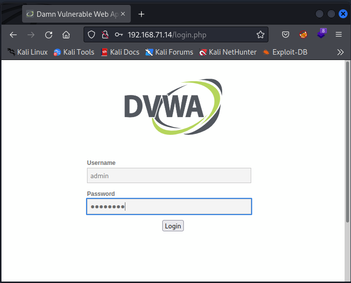
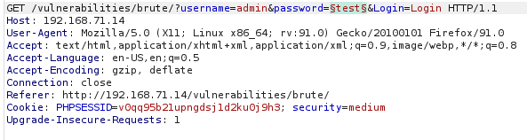
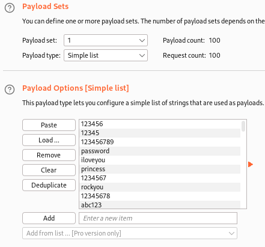
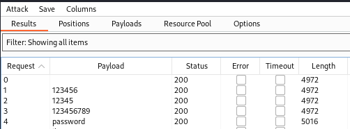

# Cybersecurity &amp; Virtualisation: 7. Burp Suite

## Slides

###  Web Application Anatomy
- Web Applications:
  - 1001 ways/languages to create, with some universally consistent things
  - Web apps are common => good starting point for a penetration test
- Model
  - Server runs on machine controlled by web app creator (responds)
  - Client runs on machine controlled by user (requests)
- HTTP standard
  - Plain text messages in a fixed structure
  - Browser and server follow this protocol
- Request
  - Structured by client, sent to server
  - Server will process it and decide what to do with is
    - Request Line
      - Method: GET, HEAD, POST, PUT, DELETE, CONNECT, OPTIONS, TRACE, PATCH
      - Unifor Resource Identifier (URI)
      - HTTP Version
    - Header
      - key-value pairs with common general/request/entitity purpose inforamtion
    - An empty line with CRLF
    - Optional Body
      - JSON
- The Web Server
  - Tries to parse the request into an understandable object and interpret it
    - Returns special error: malformed
    - Routes the request to a handler
- Request Routing
  - Matching paters in the request to handler function
  - Based on routes, a list of rules, often the URI combined with the method
  - Syntax may differ per language
  - Variables can be passed
- Request Handler Functions
  - Once matched and routed the handler function receives the request
  - A black box for the user (can be anything)
  - Creates a Response which is delivered to the Client
- Response
  - Status Line
    - 1xx Informational
    - 2xx Succes
      - 200 Ok
      - 201 created, typically after a post/put
      - 204 no content, eg after delete or no refresh form
    - 3xx Redirection
      - 304 not modified, for caching
    - 4xx client error
      - 400 bad request
      - 401 unauthorized
      - 403 forbidden
      - 404 not found
      - 409 conflict
      - 410 gone
    - 5xx server error
      - 500 internal server error
  - Header
  - Optional Body

### Burp Suite
- Burp Suite
  - Payed proxy tool to intercept analyze, modify requests
  - Popular among security specialists, for CTF
  - Also a framework for spidering, testing, analyzing, vulnerabilites checking
  - Free community edition available
  - Pre-installed on Kali, but only Temporary Projects possible
- Intercepting proxy
  - Usefull for developpers and pentesters
  - Can also be used by hackers since it is a MITM
- Proxy Traffic
  - Must be configured in browser (to use Burp Suite running on port 8080)
  - FoxyProxy extension to temporary use a proxy
- CA certificate
  - must be added to also allow https traffic to be trusted
  - http://burpsuite and import in the settings (trust downloaded certificate)
- Use (for us)
  - Target
  - Proxy: intercept/History/Options
  - Spider (no longer free)
  - Repeater
  - Intruder
- Fuzzing
  - Providing unexpected, invalid or random inputs
  - Helps identify unknown vulnerabilities and software bugs
  - Outcome monitored for crashes and errors
  - aka fuzz testing aka fault injection testing

## Lab: Burp Suite Advanced

### Configure Burp Proxy to intercept traffic
- Kali: Start up a new Temporary Project on Burp Suite Community Edition
- Tab Proxy: Turn intercept on
- Firefox: Ctrl-Shift-A: install FoxyProxy
- FoxyProxy: Add 127.0.0.1, port 8080


### DVWA
Now that we have the Burp Proxy up and running, it is time to use Burp Suite to attack a (vulnerable) website. In this part, we will use DVWA (Damn Vulnerable Web Application) as a target to train some Burp Suite skills.

First, we will need to download DVWA. Download the ISO file from https://www.vulnhub.com/entry/damn-vulnerable-web-application-dvwa-107,43/. This is a bootable live CD. Use the mirror link to download DVWA. The Damn Vulnerable Web App (DVWA) is a PHP/MySQL web application that is intentionally made vulnerable.

Create a new VM with this iso attached to the virtual optical disk drive in VirtualBox, and connect the VM to the host-only network, as we did before.  
  
Boot the VM and select live - boot the Live System. Once the VM is up and running, the web application DVWA should be accessible on port 80 of the VM.  



Look up the IP address from your new DVWA VM and use the Firefox browser of your kali VM to access DVWA using this IP address (e.g. http://192.168.100.123/).  

  

You should be redirected to the login page (e.g. http://192.168.100.123/login.php). The default credentials are ```admin:password```.  

  

Note: Since we are using a host-only network, DVWA is also accessible from your host.

A first task you could do with Burp Suite is to "spider" (read: crawl) DVWA. Spidering will follow all links in scope in an automated fashion. By following the links, Burp is identifying files, folders, forms, ... and is recording each request and response along the way. The responses are parsed in order to look for new links that should be discovered. Client-side technologies (like Angular.js) may not have all its functionality discovered. In that case manual spidering might be required as well. This means that you, as a pentester, will need to click links in order to trigger events in the framework. Once these events are triggered, requests and responses will be recorded as normal.

The timing is also important. Spidering must occur prior to any other scanning. You need to identify all possible paths and functionality prior to discovering vulnerabilities within them. The Spidering module can be found behind the Dashboard tab in the new Burp Suite interface. In the new version of Burp Suite, Spidering is now called Crawling. Crawling is now task oriented (https://portswigger.net/blog/burp-2-0-where-are-the-spider-and-scanner). To start crawling, you click on New scan and then choose active crawling. As you will notice, this feature is unfortunately not available in the free edition of Burp Suite. Nonetheless you can have a look at the sitemap, under the Target tab of the interface.
```code
$ gobuster dir --url 192.168.71.14/ --wordlist /usr/share/wordlists/dirbuster/directory-list-2.3-small.txt -x php,html
===============================================================
Gobuster v3.5
by OJ Reeves (@TheColonial) & Christian Mehlmauer (@firefart)
===============================================================
[+] Url:                     http://192.168.71.14/
[+] Method:                  GET
[+] Threads:                 10
[+] Wordlist:                /usr/share/wordlists/dirbuster/directory-list-2.3-small.txt
[+] Negative Status codes:   404
[+] User Agent:              gobuster/3.5
[+] Extensions:              php,html
[+] Timeout:                 10s
===============================================================
2023/06/06 06:25:59 Starting gobuster in directory enumeration mode
===============================================================
/index.php            (Status: 302) [Size: 0] [--> login.php]
/.html                (Status: 403) [Size: 1108]
/about.php            (Status: 302) [Size: 0] [--> login.php]
/login.php            (Status: 200) [Size: 1224]
/security.php         (Status: 302) [Size: 0] [--> login.php]
/docs                 (Status: 301) [Size: 411] [--> http://192.168.71.14/docs/]
/external             (Status: 301) [Size: 415] [--> http://192.168.71.14/external/]
/logout.php           (Status: 302) [Size: 0] [--> login.php]
/config               (Status: 301) [Size: 413] [--> http://192.168.71.14/config/]
/setup.php            (Status: 200) [Size: 3549]
/vulnerabilities      (Status: 301) [Size: 422] [--> http://192.168.71.14/vulnerabilities/]
/instructions.php     (Status: 302) [Size: 0] [--> login.php]
/phpmyadmin           (Status: 301) [Size: 417] [--> http://192.168.71.14/phpmyadmin/]
/.html                (Status: 403) [Size: 1108]
/phpinfo.php          (Status: 302) [Size: 0] [--> login.php]
Progress: 262748 / 262995 (99.91%)
===============================================================
2023/06/06 06:27:51 Finished
===============================================================

$ gobuster dir --url 192.168.71.14/ --wordlist /usr/share/wordlists/dirbuster/directory-list-2.3-medium.txt -x php,html | grep 200 
/login.php            (Status: 200) [Size: 1224]
/setup.php            (Status: 200) [Size: 3549]
/server-status        (Status: 200) [Size: 2854]
Progress: 661456 / 661683 (99.97%)
```

Next, we will explore some basic functionalities of Burp Suite, using DVWA as a target. We will start with the Intruder tab.

Navigate to your local DVWA website and log in (admin:password). On the DVWA Security tab, set the security level to 'medium'.

Navigate to the Brute Force tab. You will find a login form. Assume we know an existing username (admin), you can now try to brute force the password by intercepting the request and send this request to the Intruder. Hint: in the Intruder tab you will need to parameterize the password parameter. To speed up things, use the 10 most used passwords from the RockYou wordlist we used before.  



 

 


DVWA: POST interception and session hijacking
We will now intercept a POST request (when logging in on the index page) and then copy the PHP session ID to re-use it in a different browser.

Intercept the POST request while correctly logging in to the main page of DVWA. Make sure to copy the cookie data.

Use this data to bypass the login, using the curl command in the terminal. Hint: you can generate a curl command directly from within Burp Suite (right click -> Copy as curl command). Look at the result of the curl command and verify that you are logged in.

Make sure interception is on, and use the built-in Chromium browser of Burp Suite to login to DVWA but using an incorrect username and/or password. Modify the request, so that the cookie data you captured before is used, and change the POST url to /index.php. If you do this correctly, you should be logged in as admin!

Note that you can also just set the cookie values in your browser and surf to http://.../index.php.

This attack technique is called session hijacking, also known as cookie hijacking. Assume that a MitM-attack was performed, a session ID could be stolen, allowing the attacker to hijack the user's session.

DVWA: Reverse Shell (Expert!)
For this part, you won't need Burp Suite. The goal of this step is to execute a reverse shell attack from our Kali VM using DVWA. We will perform a command injection attack.

Make sure that DVWA is in 'medium' security level.

Navigate to the "Command Execution" section and try different inputs. See if you can perform other commands besides a ping by concatenating other commands.

If so, try to use netcat to listen in your terminal (on Kali) and connect back to your machine (on DVWA). Use of course the same port.

Tip: the default nc command on the DVWA VM cannot be used for opening a reverse shell, as this uses the netcat-openbsd version of netcat which does not support the option we need. However, if you use the nc.traditional command instead, you should be able to use the required option and open a reverse shell to the DVWA VM!

Now that we have used Burp Suite on DVWA, we will shift our focus to PortSwigger labs.

### PortSwigger Academy
In order to explore some additional features, we will use PortSwigger Academy (https://portswigger.net/web-security). PortSwigger Academy is an incredibly good source for Web Application Pen testing. Make sure to create a free account, you will need it in future labs too.

Use Burp Suite to solve the following labs in PortSwigger.

#### Lab: Information disclosure in error messages

URL: https://portswigger.net/web-security/information-disclosure/exploiting/lab-infoleak-in-error-messages

This lab's verbose error messages reveal that it is using a vulnerable version of a third-party framework. To solve the lab, obtain and submit the version number of this framework.
- With Burp running, open one of the product pages.
- In Burp, go to "Proxy" > "HTTP history" and notice that the GET request for product pages contains a productID parameter. Send the ```GET /product?productId=1``` request to Burp Repeater. Note that your productId might be different depending on which product page you loaded.
- In Burp Repeater, change the value of the productId parameter to a non-integer data type, such as a string. Send the request: ```GET /product?productId="example"```
- The unexpected data type causes an exception, and a full stack trace is displayed in the response. This reveals that the lab is using Apache Struts 2 2.3.31.
- Go back to the lab, click "Submit solution", and enter 2 2.3.31 to solve the lab.

#### Lab: Modifying serialized objects

URL: https://portswigger.net/web-security/deserialization/exploiting/lab-deserialization-modifying-serialized-objects

This lab uses a serialization-based session mechanism and is vulnerable to privilege escalation as a result. To solve the lab, edit the serialized object in the session cookie to exploit this vulnerability and gain administrative privileges. Then, delete Carlos's account.

You can log in using the following credentials: wiener:peter
- Log in using your own credentials. Notice that the post-login ```GET /my-account``` request contains a session cookie that appears to be URL and Base64-encoded.
- Use Burp's Inspector panel to study the request in its decoded form. Notice that the cookie is in fact a serialized PHP object. The admin attribute contains b:0, indicating the boolean value false. Send this request to Burp Repeater.
- In Burp Repeater, use the Inspector to examine the cookie again and change the value of the admin attribute to b:1. Click "Apply changes". The modified object will automatically be re-encoded and updated in the request.
- Send the request. Notice that the response now contains a link to the admin panel at ```/admin```, indicating that you have accessed the page with admin privileges.
- Change the path of your request to ```/admin``` and resend it. Notice that the ```/admin``` page contains links to delete specific user accounts.
- Change the path of your request to ```/admin/delete?username=carlos``` and send the request to solve the lab.

#### Lab: Information disclosure on debug page

URL: https://portswigger.net/web-security/information-disclosure/exploiting/lab-infoleak-on-debug-page

This lab contains a debug page that discloses sensitive information about the application. To solve the lab, obtain and submit the SECRET_KEY environment variable.
- With Burp running, browse to the home page.
- Go to the "Target" > "Site Map" tab. Right-click on the top-level entry for the lab and select "Engagement tools" > "Find comments". Notice that the home page contains an HTML comment that contains a link called "Debug". This points to ```/cgi-bin/phpinfo.php```.
- In the site map, right-click on the entry for ```/cgi-bin/phpinfo.php``` and select "Send to Repeater".
- In Burp Repeater, send the request to retrieve the file. Notice that it reveals various debugging information, including the SECRET_KEY environment variable.
- Go back to the lab, click "Submit solution", and enter the SECRET_KEY to solve the lab.

#### Lab: High-level logic vulnerability

URL: https://portswigger.net/web-security/logic-flaws/examples/lab-logic-flaws-high-level

This lab doesn't adequately validate user input. You can exploit a logic flaw in its purchasing workflow to buy items for an unintended price. To solve the lab, buy a "Lightweight l33t leather jacket".

You can log in to your own account using the following credentials: wiener:peter
- With Burp running, log in and add a cheap item to your cart.
- In Burp, go to "Proxy" > "HTTP history" and study the corresponding HTTP messages. Notice that the quantity is determined by a parameter in the ```POST /cart``` request.
- Go to the "Intercept" tab and turn on interception. Add another item to your cart and go to the intercepted ```POST /cart``` request in Burp.
- Change the quantity parameter to an arbitrary integer, then forward any remaining requests. Observe that the quantity in the cart was successfully updated based on your input.
- Repeat this process, but request a negative quantity this time. Check that this is successfully deducted from the cart quantity.
- Request a suitable negative quantity to remove more units from the cart than it currently contains. Confirm that you have successfully forced the cart to contain a negative quantity of the product. Go to your cart and notice that the total price is now also a negative amount.
- Add the leather jacket to your cart as normal. Add a suitable negative quantity of the other item to reduce the total price to less than your remaining store credit.
- Place the order to solve the lab.

## misc:
- see if pings come back
- $ sudo tcpdump -i tun0 icmp
- proxy setup: https://www.youtube.com/watch?v=iTm33Miymdg