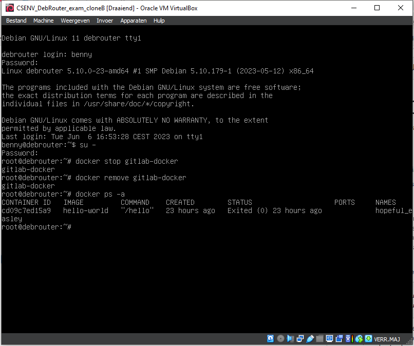
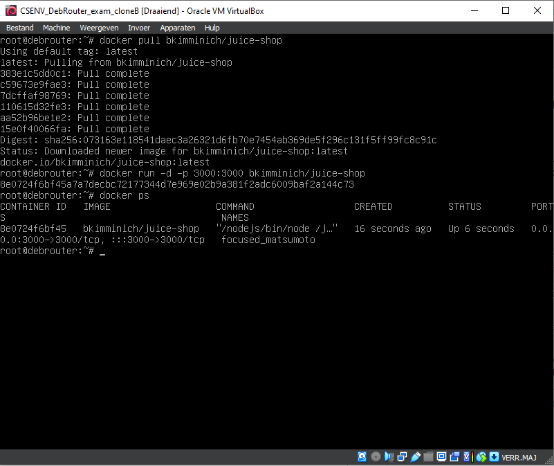
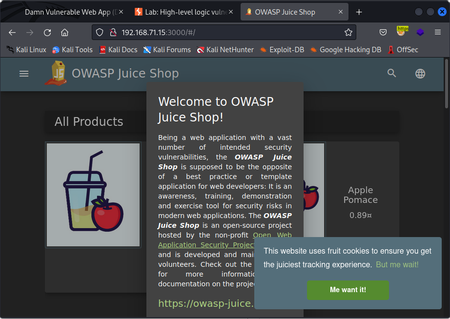

# Cybersecurity &amp; Virtualisation: 8. OWASP

## Slides

### OWASP

- OWASP
  - Open Web Application Security Project
  - Free &amp; open resources in web app security
  - Led by non-profit OWAS Foundation
- Top 10
  - Every 3-4 years, fed by 40 partner organisations
  - Awareness document containing most critical security risks
  - Now 2021: Form: A01:201-Broken Access Control, ...
  - Also in other fiels : Mobile, API, Machine Learning
- ZAP
  - Zed Attack Proxy
  - MitM Proxy : open source alternative to BurpSuite

### Broken Access Control

- Ranked numer 1: most occurences
- 34 Common Weakness Enumerations map to is, such as Exposere to and insertion of Sensitive Information &amp; CSRF
- Users normally may not act outside of their intended permissions
- Failures: unauthorized disclosure, modification, destruction, unauthorized business function execution
- Such as ...
  - No access controls for post, put, delete in accessing API
  - bypassing access control
  - elevation of privilege
  - csrf
  - JSON Web Token tampering
- CSRF : Cross-Site Request Forgery
  - When server allows a request from a client and has no mechanism for verifying the intenstionality of that reques
  - Attackers can trick clients into sending such **unintentional** request and the server wil treat it as authentic
  - Possible via URL, image load, hidden forms, ... => possible exposure of data or unintended code execution
  - Circumvents the same origin policy, designed to prevent website interference
  - 3 Conditions:
    - A relevant action, that the attecker has a reason to induce
    - Cookie-bases session handling, and solely this to identify the requesting user. No other mechanism.
    - No unpredictable (for the attacker to know or guess) request parameters
  - Howto?
    - Manually creating HTMl needed for exploit
    - CSRF PoC generator in Burp Suit Professional / browser plugin
  - Common vulnerabilities
    - Due to mistakes in valitation of CSRF tokens, which even used still can be broken (by GET instead of POST)

### Cryptographic failures

- Second in Top 10
  - Previously: Sensitive Data Exposure
  - Related to (lack of) cryptography
  - Confidentiality might be broken
    - Hard-coded passwords
    - Broken/Risky Crypto Algorithm
    - Insufficient Entropy
  - Cryptographic failures
    - Data (passwords, credit card numbers, personal info, ...) needs to be protected
    - Possible preventions include disbling caching, secure protocols, salting and work factor, authenticated encryption
  - Example attacks
    - automatic dcerytion when retrieving from a database allows sql injection to retrieve the data
    - Non enforced TLS makes interception of data possible
    - Unsalted or simple hashes: Crackable by GPU's and rainbow tables

### Cryptographicfailures

- 7th in Top 10
  - Previously: Broken Authentication
    - CWE's related to identification
    - Confirmation of identity/authentication/session management necessary
    - Eg. session fixation, improper auth, Improper Validation of Certificate
- When app ...
  - permits automated attacks
  - permits brute force
  - permits default, weak, weel-know passwords
  - uses weak credentiam recovery and forgot-password processes
  - uses plain text password data stores
  - has missing or ineffective multi-factor authentication
  - exposes session identifier in the URL
  - reuses this after successful login
- Prevent by ...
  - multi factpor
  - disabling default credentials
  - decent password policy
  - harden the app
  - restrict and log failed attempts
  - random session id with high entropy and regenerated

### Browser as a helpful(pentester) tool29

- The browser can be very helpful
  - Interesting extensions such as HackTools, HackBar, cookie-editor
  - Default F12 Developer Tools
    - inspect network traffic
    - modify HTML/JavaScript
    - debug client-side scripts

## Lab: OWASP TOP 10 Vulnerabilities

In this lab, we will explore some of the top vulnerabilities and security risks in modern web applications, using the Juice Shop web application.

### Installing and using Juice Shop

For this lab, we will need the Juice Shop web application. We will deploy this application using Docker, on the first clone of our Debian router (= the VM with Docker and GitLab that we used for the Scan Enumerate Exploit of lab 5, step 5.2.3).

Power on your Debian router VM, the first clone (with GitLab) and the Kali VM.

On the first clone, stop the GitLab Docker container you deployed in lab 5. You can also remove this container if you want, as we won't need it anymore.  

On the same VM, execute the following commands to deploy the Juice Shop on Docker:

sudo docker pull bkimminich/juice-shop
sudo docker run -d -p 3000:3000 bkimminich/juice-shop  

The docker container should be accessible on port 3000 (if this port was not in use yet, you can always change the host port in the previous command if needed). Verify that you can access the Juice Shop application from the Firefox browser on your Kali VM (http://x.x.x.x:3000 with x.x.x.x being the IP of the first clone). Note that you can also access the website from your host machine (as we are using a host only network).  

We will use this setup to solve several challenges within the Juice Shop.

By the way, did anyone order some fireworks?

###♦ First steps with Juice Shop
In this first step you will get familiar with the Juice Shop website. On your Kali VM, open a Firefox browser and navigate to the Juice Shop (http://x.x.x.x:3000).

- Your first objective is to find the carefully hidden 'Score Board' page. Tip: Open the Debugger tab of the Developer tools (F12) in the Firefox browser and look for some the JavaScript files.

- Your next goal is to retrieve the login of the admin user. Browse to the login page and use a simple SQL injection attack to authenticate as the first user in the Users table (which will be the admin). Can you find the e-mail address of this account?

- Next step: crack the password of our admin user. On the login form, enter the e-mail address you just found and some dummy data as password, and use Burp Suite to intercept the request. Use a simple dictionary attack to brute-force the password, using the common passwords found in /usr/share/wordlists/fern-wifi/common.txt.

- Now that you have found all required information, log in on the juice shop as admin user. You now have admin access to the site. You will need this in the future (e.g. during the XSS challenge next class).

- For now, you can look around and find yourself a good juice or go to the next lab. Make sure you register an account on Juice Shop.

#### Broken Access Control

Broken Access Control is one of the main vulnerabilities in Web Applications. Let's find out what it is all about!

- Access the administration section of the store
A little bird once told me that the Juice Shop contains an admin section. However, just like the score board, the admin section was not part of your "happy path" tour because there seems to be no link to that section either. In case you were already logged in with the administrator account you might have noticed that not even for him there is a corresponding option available in the main menu. But can you find the admin section?

  - Knowing it exists, you could simply try to guess what URL this admin section might have.
  - Alternatively, you can try to find a reference or clue within the parts of the application that are not usually visible in the browser.
  - It is probably just slightly harder to find and gain access to than the score board link. Remember how we found that one?
  - There is some access control in place, but there are at least three ways to bypass it. And luckily, we already found the login for the admin user anyhow.

- View another user's shopping basket
This horizontal privilege escalation challenge demands you to access the shopping basket of another user. Being able to do so would give an attacker the opportunity to spy on the victims shopping behaviour. He could also play a prank on the victim by manipulating the items or their quantity, hoping this will go unnoticed during checkout. This could lead to some arguments between the victim and the vendor.

To solve this challenge, login as the admin user and try to find a way to access the shopping basket of a different user.

  - Try out all existing functionality involving the shopping basket while having an eye on the HTTP traffic.
  - There might be a client-side association of user to basket that you can try to manipulate.
  - In case you manage to update the database via SQL Injection so that a user is linked to another shopping basket, the application will not notice this challenge as solved.

- Put an additional product into another user's shopping basket
View another user's shopping basket (previous exercise) was only about spying out other customers. For this challenge you need to get your hands dirty by putting a product into someone else's basket that cannot be already in there!

  - Check the HTTP traffic while placing products into your own shopping basket to find a leverage point.
  - Adding more instances of the same product to someone else's basket does not qualify as a solution. The same goes for stealing from someone else's basket.
  - This challenge requires a bit more sophisticated tampering than others of the same ilk.

- (Advanced!) Log in with Bjoern's account
The author of the OWASP Juice Shop was bold enough to link his Google account to the application. His account even ended up in the initial user records that are shipped with the Juice Shop for your hacking pleasure!

If you do not see the Log in with Google button, do not despair! The hostname your Juice Shop is running on is simply not configured in the OAuth integration with Google. The OAuth-related challenges are still solvable! It might just take a little bit more detective work to find out how an OAuth login is handled.

Bjoern has registered via Google OAuth with his (real) account. It should be quite easy to find his e-mail address if you have solved the previous exercise. Now, your goal is to login using this e-mail address.

  - There are essentially two ways to light up this challenge in green on the score board:
    - In case you happen to be Bjoern Kimminich, just log in with your Google account to automatically solve this challenge! Congratulations!
    - Everybody else might want to take detailed look into how the OAuth login with Google is implemented.
  - It could bring you some insight to register with your own Google account and analyze closely what happens behind the scenes.
  - The security flaw behind this challenge is 100% Juice Shop's fault and 0% Google's.
The unremarkable side note without hacking his Google account in the challenge description of the score board is not a joke. Please do not try to break into Bjoern's (or anyone else's) Google account. This would be a criminal act.

Hint: To crack the password, you will have to look inside the JavaScript code. Your main goal is to discover how the password is generated and saved.
